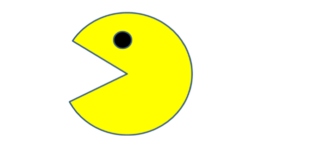

# 1. Project Title: Pacman
  He is laughing loud while travelling along the screen. In fact he is not. It is computer that assimlate as if pacman is laughing. Interestingly, it is JavaScript that swaps image icons, which were stored on the file, at certain time and position
    
# 2. Motivation
   This is learning setup. This appilcation could not accomplish anything benefical than learning. 
# 3. Build Status
   This project currenlty tested on some in chrom browser and working as expected. Howerver, this doen't mean that somebody could use this code to accomplish anything practical in business world. 
# 4. Code Style
   Applied coding style that is recommended for Java HTML,CSS, and Javascipt
# 5. Tech/Framework used
    HTML5/CSS5/JavaScrip 2020 are frameworks used for developing this code
# 6. Installation
   Installation of this simple. It doesn't require specialized server to run this service. It can run on Linux, Window, Mack or other similar platforms as HTML/CSS/JAVASCRIPT are language of the Internet. 
   However, for better performance, it shold depolyed to didicated serves which are running incolud or inhouse.
# 7. API References
  Users can point to this service like this: https//userdomain:userport/uri/bustracker.html
# 8. Tests
  This app needs additional test. It passed developer test. Integration or user test is remaning activity that will get performed when better features and functionality add to this app
# 9. How to Use
  Users connected to internet can call this application from any location in the world. Applicaiton endpoint could appear on on google search;
# 10. Contribute
  This project will grow and need contribution from developers and subject matter experts. Particularily UI developers contribution is vital to make this project useful for others
# 11. Credit
 Several individuals are behind this project. Special thanks to MIT-xPRO Emiritus staff who scrificed their time and knowledge while teaching and supporting students. There are studens who contributed when
  working with this project. Special thanks goes to all whom supported directly or indireclty for this project. I would not for get to thank Git Hub. Without GitHub, we would not learn this interesting subject.
  Git Hub provided us with platforms to store and run this appilication on their cloud server. Again thank you GitHub making our life easire!!
# 12. License
  GitHub, MIT and others technology owners products/services/logs are their own. 
